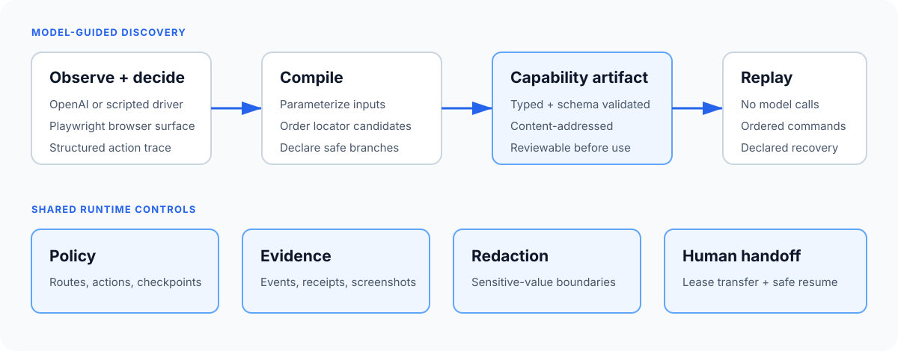
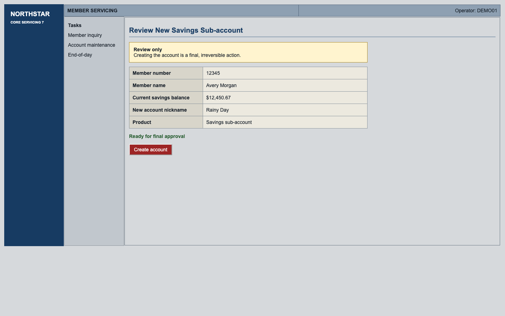
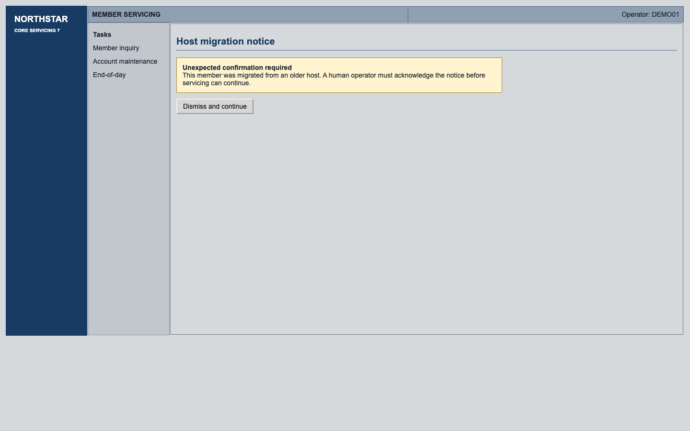

# Computer-Use Automation System

[](https://github.com/bgivenb/computer-use-automation/actions/workflows/ci.yml)

Discover workflows through live UI interaction. Compile them into typed capabilities. Review the
artifact and its permissions, then replay without model decisions—or return control to an operator
when execution cannot safely continue.

A local TypeScript runtime for applications whose only integration surface is their UI. The included
legacy bank-servicing application is a synthetic test environment, not a required backend.

The project focuses on the hard parts of dependable computer use: generated element IDs, nested
tables and frames, explicit policy boundaries, deterministic recovery, evidence integrity, and
same-session human intervention. The demo uses synthetic data and a deliberately awkward legacy
bank-servicing interface.



## Why this design

- **Discovery and execution are separate.** A model can explore once; repeat runs consume the
  reviewed artifact and report `modelCalls: 0`.
- **The artifact is the control plane.** Inputs, locator candidates, allowed branches, recovery, and
  checkpoints are typed and schema validated.
- **Evidence is verifiable.** Events, screenshots, manifests, and SHA-256 digests make the run
  inspectable without preserving credentials.
- **Unexpected states stop safely.** Automation releases its lease before a human takes control, and
  resume is refused until the declared checkpoint passes.

## Runtime, not just a recording

- **Two discovery modes.** Guided mode follows reviewed step semantics. Exploration chooses its own
  action sequence within the same permissions, then validates checkpoints against the newly observed
  screen. Both produce drafts; neither can approve itself.
- **Review lifecycle.** Inspect capabilities, compare revisions with `jsondiffpatch`, and approve an
  exact artifact + runtime policy using Ed25519 signatures. The `run` command checks an independently
  trusted public key and expiry before starting a browser. Any content or policy change invalidates approval.
- **Reusable entry points.** Supply a goal, target, typed profile, inputs, and independent runtime
  policy. Browser operations implement a `SurfaceAdapter`; browser-specific human control remains
  in the runtime composition layer. Desktop support is not implemented.
- **Measured failure behavior.** A repeatable browser evaluation covers nine scenarios, including
  expired sessions, host validation, ambiguous controls, slow loads, and hostile page text.

See [operations and approval](docs/OPERATIONS.md), [engineering decisions](docs/ENGINEERING.md),
and [evaluation methodology](docs/EVALUATION.md).

## Proof of behavior

| Review boundary | Same-session human handoff |
| --- | --- |
|  |  |

`/evidence/` preserves the original guided OpenAI recording and five replay scenarios, plus a fresh
[exploration recording](evidence/exploration/summary.json) with nine real model calls and its
[changed-input replay](evidence/exploration-replay/summary.json) with zero model calls. Exploration
chose a different sequence: it read the balance at the review screen instead of the member-detail
screen. The [measured replay baseline](docs/EVALUATION.md) covers 27 synthetic browser trials.
Scripted fixtures are never represented as provider evidence.

## What the demo does

The local target is an intentionally awkward bank-servicing UI: nested tables, an iframe, generated
element IDs, and sparse semantics. The capability searches for a synthetic member, reads their name
and savings balance, prepares a savings sub-account, and stops at the review checkpoint before the
irreversible **Create account** action.

| Member | Runtime state | Expected result |
| --- | --- | --- |
| `12345` | Normal flow | `success` with name and balance |
| `00000` | No matching record | `business_outcome / member-not-found` |
| `77777` | One transient detail failure | Declared recovery, then `success` |
| `88888` | Permission denial | Non-retryable `failure / permission` |
| `99999` | Unexpected host notice | Same-session human handoff, then `success` |

Discovery and replay share contracts, policy, redaction, event recording, and the browser surface.
Only discovery receives a `ModelDriver`. Replay executes the artifact's ordered commands and declared
branches directly and reports `modelCalls: 0`.

## Setup

Requirements: Node.js 22+, npm, and a Chromium build installed by Playwright.

```bash
git clone https://github.com/bgivenb/computer-use-automation.git
cd computer-use-automation
npm ci
npm run browser:install
```

No credentials are needed for the target app, replay, tests, or scripted fixture. All records are
synthetic and all servers bind to loopback.

Run the full local quality gate:

```bash
npm run verify
```

This checks formatting, lint, types, tests, the production build, evidence integrity, and secret
patterns across tracked and untracked non-ignored files.

## Offline fixture path

Run the complete local scenario without an API key:

```bash
npm run demo
```

This starts the hostile UI on an ephemeral loopback port, uses `ScriptedModelDriver` to exercise the
real discovery loop, compiles an artifact, and replays all five fixtures. Generated artifacts, JSONL
events, summaries, and screenshots stay under ignored `.runs/` paths.

To inspect the agent-to-artifact and artifact-to-replay steps separately:

```bash
npm run discover -- --driver scripted \
  --artifact .runs/scripted-draft.json

env -u OPENAI_API_KEY npm run replay -- \
  --artifact .runs/scripted-draft.json \
  --member-id 12345 \
  --nickname "Rainy Day"
```

The first command uses a scripted fixture, not a live model. Provider-backed recordings are identified
separately in the evidence package.

## Genuine discovery and deterministic replay

Use a locally configured key in the shell that launches discovery. Do not commit it or
paste it into evidence.

```bash
export OPENAI_API_KEY="<your-local-key>"
export OPENAI_MODEL="gpt-5.4-mini"

npm run discover -- --driver openai --headed \
  --artifact .runs/guided-draft.json
```

The CLI starts the live local target, runs one structured OpenAI Responses decision per observation,
verifies the review checkpoint, writes the artifact, and reports the run directory. Provider request
storage is disabled. After discovery, prove replay has no credential dependency:

```bash
unset OPENAI_API_KEY

npm run replay -- \
  --artifact .runs/guided-draft.json \
  --member-id 12345 \
  --nickname "Rainy Day"
```

Replay returns structured JSON containing the artifact digest, terminal result, normalized execution
signature, evidence references, and `modelCalls: 0`.

To discover the sequence without a prescribed next step:

```bash
npm run discover -- --driver openai --mode explore \
  --artifact .runs/exploration-draft.json
```

Exploration checkpoints and recovery coverage require review; one successful run is not a reliability
claim. The existing `replay` command is the local bank fixture path. Use the approval-gated `run`
command for an independently configured target, as shown in the operations guide.

Run a credential-free evaluation (three repetitions of each scenario):

```bash
npm run evaluate -- --repeat 3
```

## Exceptional paths and handoff

The checked-in guided example includes the exceptional branches below. These commands use that
example by default; a newly explored draft needs its own recovery review. Artifact writes refuse
existing destinations, so choose a new path for each discovery.

```bash
npm run replay -- --member-id 00000   # legitimate business outcome; exit 0
npm run replay -- --member-id 77777   # safe one-time recovery; exit 0
npm run replay -- --member-id 88888   # permission failure; exit 4
npm run replay -- --member-id 99999   # automated operator-fixture handoff; exit 0
```

For a person-driven handoff, use:

```bash
npm run replay -- --member-id 99999 --interactive
```

Open the printed loopback operator URL, claim the intervention, click **Dismiss and continue** on the
live screenshot, then select **Verify and resume**. The automation lease is released before the human
lease is granted; resume is refused until the declared checkpoint passes. The target `Page` and
`BrowserContext` are preserved, and human actions are added to the run event stream.

## Evidence and repository guide

Local runs are private working data under `.runs/`. Curated `/evidence/` includes the genuine
discovery log, saved artifact, success, business-outcome, recovery, failure, and handoff replays.
Every manifest entry includes SHA-256 hashes and a declared model-call count; `npm run
evidence:verify` validates file integrity, event schemas and ordering, run IDs, artifact provenance,
and the zero-model replay boundary.

- `src/core/` - strict Zod contracts, events, policy, and redaction
- `src/discovery/` - provider-neutral driver seam, OpenAI adapter, and scripted fixture
- `src/artifact/` - parameterization, compilation, and deterministic replay
- `src/surface/` - Playwright perception, targeting, checkpoints, and evidence capture
- `src/runtime/` - browser-session lease and operator handoff
- `src/demo/` - synthetic hostile legacy target and runtime fixtures
- `src/evidence/` - evidence verifier and tracked-text secret scanner
- [`REPORT.md`](./REPORT.md) - design decisions, limits, and explicit cuts
- [`SPEC.md`](./SPEC.md) - executable product and acceptance specification for the built slice

## Scope and license

This is an independent reference implementation built with synthetic data. It is not employer or client code, and it does not connect to a real financial institution.

Licensed under the [MIT License](LICENSE). Third-party dependencies remain under their respective licenses.
